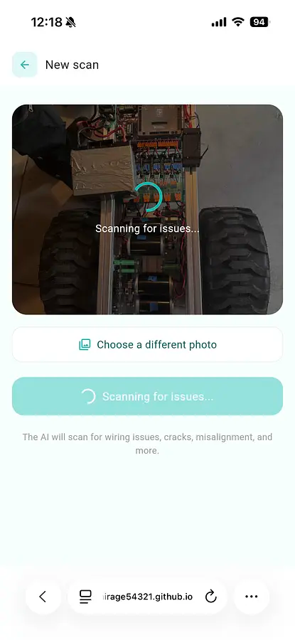
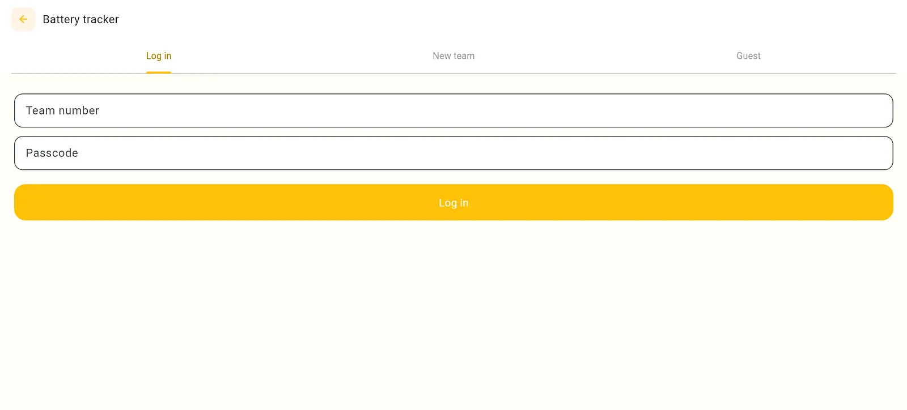

# DOCUMENTATION

## Devlog #1 ->
I have finished the foundation of my project! The app currently has a simple UI and one AI tool that takes in a photo and tells you problems found in the photo whether it's with frayed wiring, loose screws, cracked/bent frames, or corrosion. 
Goal of my project: cut down the time it takes to find an issue so that a FRC team has more time to actually fix the problem and flag problems a human might miss during a rushed pit-stop check.
Overall, working with flutter to program a UI wasn't too bad. I have always been used to Java and JavaScript so although it isn't exactly the same, I soon learned how to write in Dart.
I've had the most difficulties with the implementation of the AI. At first, I started with an Ollama model. However, it was very slow so it would timeout before sending in anything that it had noticed in the photo. I then found that Google lets you use a free Gemini model so I got an API for that and finally added that. The new problem I faced was that everytime I tried to publish my app as a github page, the API key would turn off because the key wasn't safe. I finally learned that the key needs to be stored in a backend in order to function so I utilized Render.
I am so proud of how my project is looking so far! I plan to add more tools like a rules scanner. 

 

## Ship #1 - > 
Anonymous feedback from other users at this point:
- When I tried uploading a photo of my team's bot, I got an error saying that the scan failed due to an exceeding of the quota from Google API's. It seems that the Gemini implementation isn't working properly due to an influx of people testing. Perhaps you could try to host some AI locally on the website itself? Not sure how that'd work out, though.
- Your project is really nice! Great job! Your project is very unique and something I haven't seen before. I also think that you did a great job in putting a lot of effort in developing the features. The usability was great and this type of project is very useful for robotics teams. Storytelling, however, could be improved. You could talk about challenges you faced and what features you are curious about for the future.
- first of all FRC MENTIONNED AYYY so so so cool and i understand how useful this could be so im super impressed the rule checking feature is so sick honestly would love to try it out but our robot is not present so i cant :( nice look to the app it looks clean and seems to run smoothly so keep up this amazing work :3 !!
- Nice project but since i dont have any robot to check i count try it so well but im pretty sure it works well. Keep up the nice work!
- Nice project but since i dont have any robot to check i count try it so well but im pretty sure it works well. Keep up the nice work!
- this looks good but it looks expencve in api credits and if you want better responces you need more MP and price is high and also with a team you can do this well
- This sounds like a good idea! I have some friends in FRC so I'll let them try it. One thing I would add is allowing people to upload multiple photos, as maybe just one photo isn't enough and it would be easier to show the whole robot. 
- Good idea, although I think it would have been better not to use an AI based system due to the negative connotations there in the nerd community.
- Hey great project! Let's start off with critiques. I think some more detailed devlogs/documentation would totally spice up your project. And a video demonstrating it might be worth it as not everyone has pictures of a FRC robot. I like how this project could have real world impact. I myself am on a FRC team and it's a pain when something you expect to happen the whole season fails to work because of a small thing you failed to catch with your eyes. The UI is nice and modern. I like it! Good work!
- Strong niche idea; demo is clear, and more examples/sample photos would help testing.
- Really good idea, however the dev logs could use alot of work, as there is only 1. However the finished product is quite usable and looks complete.
- I really like this project. I mean it is very needed, and I like how it is made. The main thing I would say it make the gui a bit more friendly, rather than having it so harsh, however besides that I really like the idea.

## Devlog #2 ->
Now that I've finished the foundation of my project, I can keep adding tools! On my last ship, I realized I should keep more documentation. So be ready for more devlogs going forward!
To get a little more comfortable with what I'm doing, I decided to add another AI scanning tool that I have been thinking about: a rules checker. The general scanner already looked for physical problems like wiring and cracks, but I wanted something that could actually check a robot against the official FRC rulebook. So I added the actual PDFs of past FRC game manuals (2024, 2025, and 2026) and let the user pick which season's rules to check against. That PDF gets fed into the AI alongside the photo, so instead of relying on whatever general FRC knowledge the model already has (which could be outdated or made up), it's reading the exact rulebook for that year while it looks at the image.
Getting the PDF into the AI request in the first place took some figuring out. I had to load it from the app's assets, converting it into a format the API would actually accept, and making sure it got sent alongside the image without breaking anything. Once it worked though, the difference was noticeable (the AI's answers started actually referencing real rules instead of guesses).
The bigger challenge was AI usage limits. Not "too many messages" though. Instead, it was more that other people using the same free model at the same time meant my requests were competing with everyone else's. Half the time a scan would go through fine, and the other half it just wouldn't, with no real pattern I could find.
To fix this I... haven't yet, honestly. Still an open problem :(. Hoping to hear from you guys for some ideas!
I'm a little nervous because AI kind of has a negative connotation in FRC. To address that issue, I'm planning to make the whole app not centered around AI so I'll be adding more tools.
Excited to keep going though, because I just started programming my new idea: adding a battery tracker!
View it here: https://mirage54321.github.io/Robolens/

## Devlog #3 ->
In the past few days I have been working on adding a battery tracker because I believe that it has the potential to be very helpful to FRC teams. Tracking batteries is always a pain for my team, and other teams I've connected with can probably agree with that statement. Batteries can randomly fail by not charging or just full-on dying in two minutes. Although one might assume that keeping track of all this is easy, it truly is not. Having a system to hold records and data, I believe, can be very helpful to teams!
I've added the third tool to the app: a shared battery tracker where a team can log in with a team number and passcode, add batteries, and mark each one as charging, in use, or available. It also lets you flag a battery as weak or unreliable with a note, so if a battery dies mid-match, the whole team can see that history the next time they're deciding which one to grab. I even added an option for the AI to recommend which battery to use next based on how long it's been charged and whether it's been flagged before.
My new challenge for this tool has been working with MongoDB. It stores the data fine, but it wasn't letting me log in (it kept throwing an error). What confused me more is that when I ran it in Flutter web, it worked just fine. This is what I plan to work on for the next few days.
To fix my last problem, which was with the AI saying it had spikes in usage, I changed the message to ask the user to try again because it usually works on the try right after. Right now, this is just a temporary solution until I can find a new AI model.
List of things to work on:
- Low MongoDB storage for free account
- Report button on the UI needs to feed into the AI
- Find permanant solution for the AI usage
- Connenction to MongoDB working for flutter web but not github?
- Photo to video (that way it can help you find the right orientation for the AI to scan with the best feedback possible)
View it here: https://mirage54321.github.io/Robolens/
  

## Devlog #4 ->
...Currently being worked on...

## Current problems:
- Low MongoDB storage for free account 
- Report button on the UI needs to feed into the AI ⭐
- Find permanant solution for the AI usage
- Connenction to MongoDB working for flutter web but not github? ⭐⭐⭐
- Photo to video (that way it can help you find the right orientation for the AI to scan with the best feedback possible) ⭐⭐